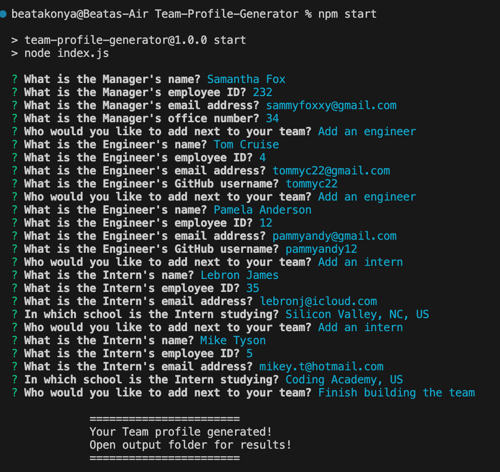

# Team Profile Generator

## Table of Contents

* [Description](#description)
* [Demo Video](#demo-video)
* [Screenshots](#screenshots)
* [Installation Instructions](#installation-instructions)
* [Usage](#usage)
* [Technologies Used](#technologies-used)
* [Tests](#tests)
* [Contributions](#contributions)
* [Questions](#questions)
* [Badges](#badges)

## Description

This project is a CLI application created with Node.js that generates a html page with through the user's input and provided data. The user can input data for names, roles, IDs, email addresses, an office number (for managers), GitHub links (for engineers), and schools (for interns.) The generated html file, in this case is created in the output folder. The user can change this to their benefit if they wish. Before usage, please use the necessarry commands in order to make sure that the app runs smoothly.

## Demo Video

[Link to Demo Video for terminal commands](https://drive.google.com/file/d/1iSxLT8HwJ3VooWu1lInpJS_98X-SqXcy/view)
[Video Link to Browser View](https://drive.google.com/file/d/1BnTgri_Gf8FA-4Dis_fu4I5tik1B7aPP/view)

## Screenshots

  
## Installation Instructions

- Clone repository.

- cd into cloned directory and install required dependencies by entering the following command:

`npm install`

Once you installed the dependencies, you can start the application by entering the following command:

 `node index.js` or `npm start`

 Answer the questions and create your team. You must enter an answer, otherwise the system will notify you that you did not input any information.
 Once the terminal states that your app has been generated. Please navigate to the `output` folder to find your html file. 

## Usage

The app is created to provide a quick tool for managers to input employee data. The user can add employees and inters with name, ID, email address, and roles. The commands generate a webpage after the user provided the required data. 

## Technologies Used

  

## Tests
If you wish to run tests please use the following commands:

`npm run test` or `npm test`

## Contributions
  
Thanks to the EdX Bootcamp for providing the starter code and necessary tools in order to  complete this project. 

The following resources were also utilized:

- Additionally information was utilised from [npmjs inquirer](https://www.npmjs.com/package/inquirer) in order to create a working app.

- I also utilised nodejs information from [w3schools](https://www.w3schools.com/nodejs/).

- [Mimo](https://mimo.org/) and [Sololearn](https://www.sololearn.com) was also used to  assist with the development process.

- If you wish to contribute to this project, do let me know. I am open for suggestions and improvements as always.

- The background image was sourced for this project from [freepik](https://img.freepik.com).

- Thanks to my friend Shlomi to guide me with some of the codes in order to make sure my app is running smoothly.

## Questions

If you have any questions please contact me on the following e-mail [here](mailto:beatakonya@gmail.com?subject=[GitHub]%20Dev%20Connect) or visit [github/beatak777](https://github.com/beatak777).

## Badges

